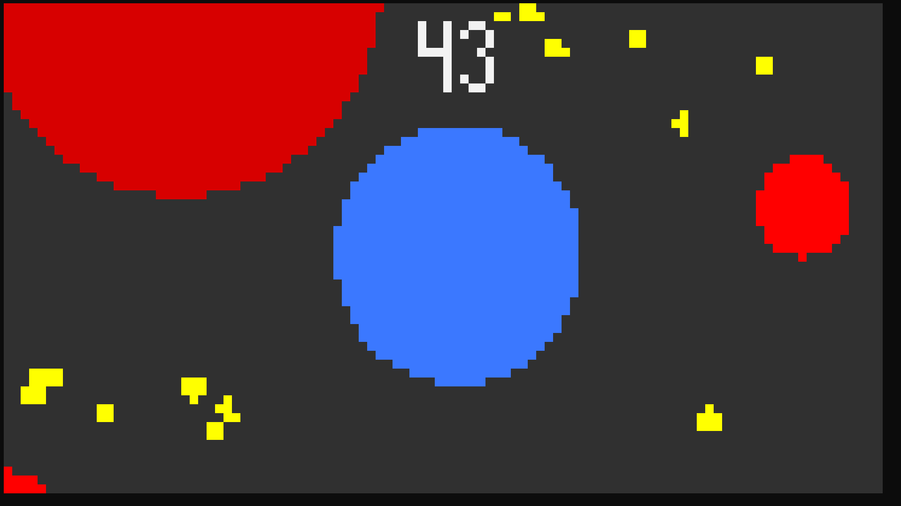
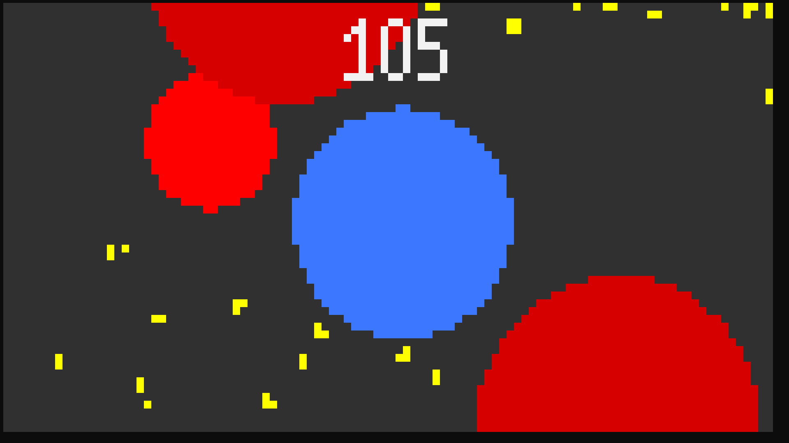
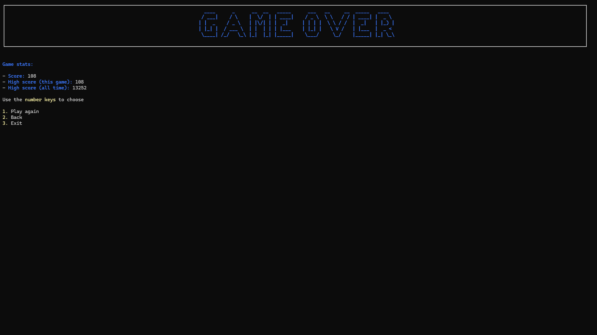
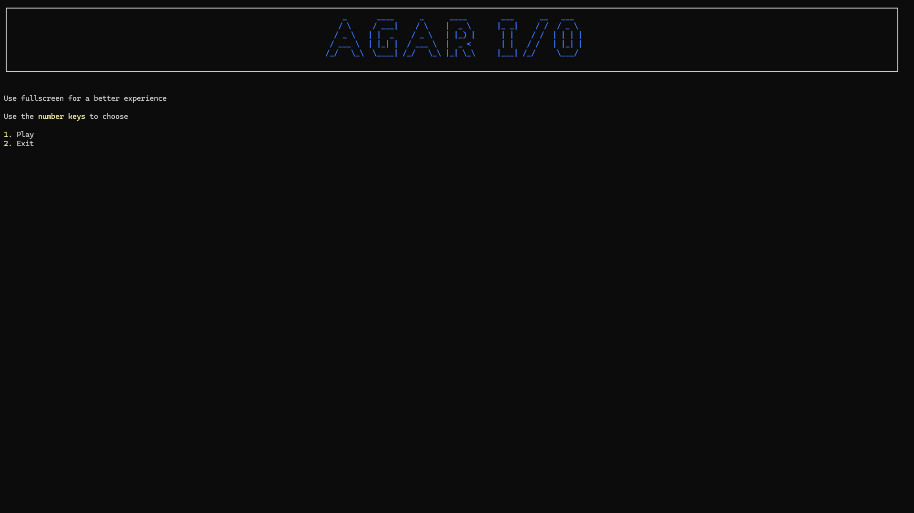
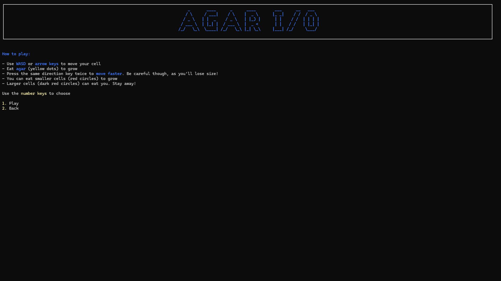

# Agar I/O

Agar I/O is my own version of the classic online game Agar.io, built to run in the terminal.

In Agar I/O, you play as a cell fighting for its survival.
You can grow in size by eating agar or consuming smaller cells.
Be careful though, as larger cells want to grow as well. Stay away to avoid being eaten!

## How to Install

1. Download the build for your OS from the [GitHub Releases](https://github.com/Mikuel210/AgarIO/releases/latest) page. 
2. Inside the `publish` folder:

   - **Windows:** Run the `.exe` file.
   - **macOS / Linux:**
   
     1. Give the file execute permission:
        ```bash
        chmod +x AgarIO
        ```
     2. Run it:
        ```bash
        ./AgarIO
        ```

## How to Play

- Use **WASD** or the **arrow keys** to move your cell
- Eat **agar** (yellow dots) to grow
- Press the same direction key twice to **move faster**. Be careful though, as you'll lose size!
- You can eat smaller cells (red circles) to grow
- Larger cells (dark red circles) can eat you. Stay away!

## Gallery











